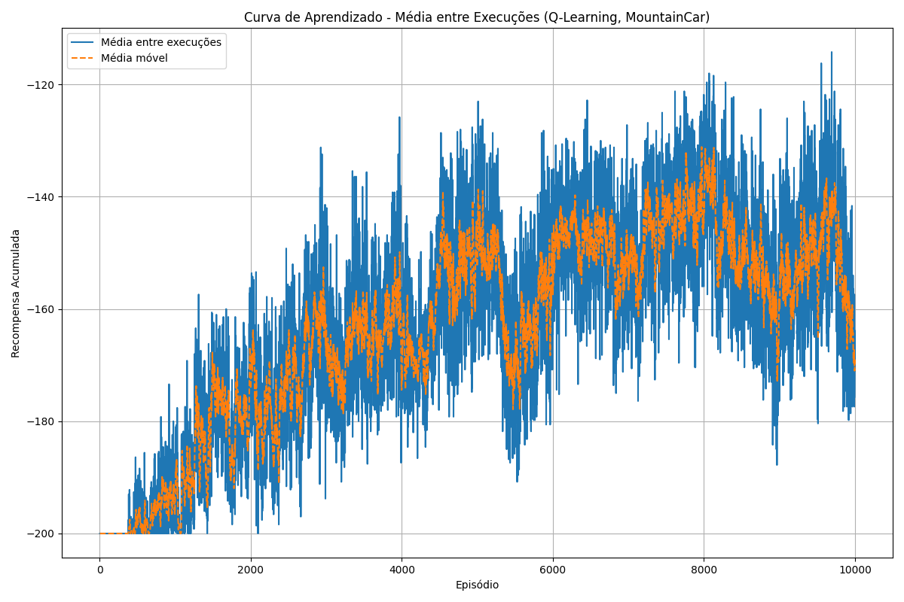
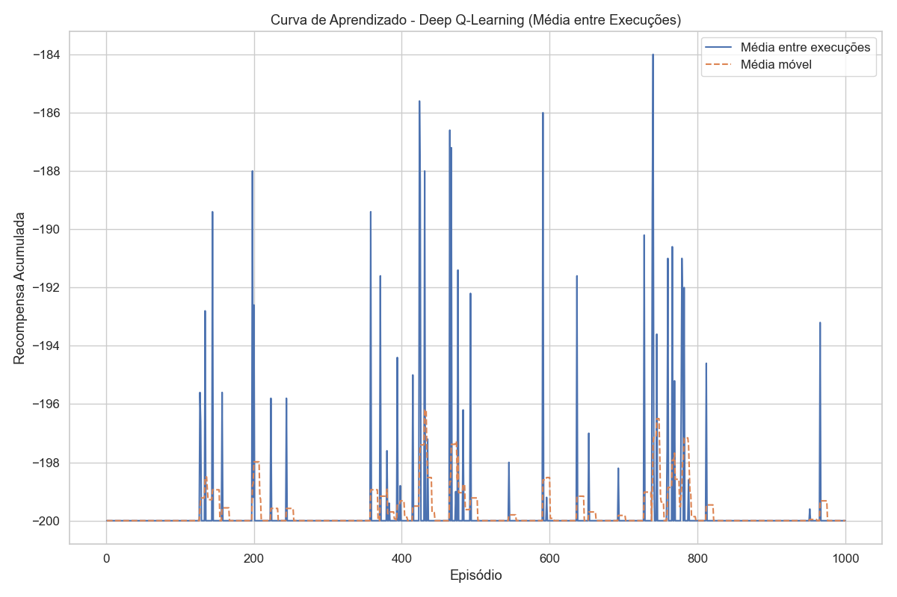
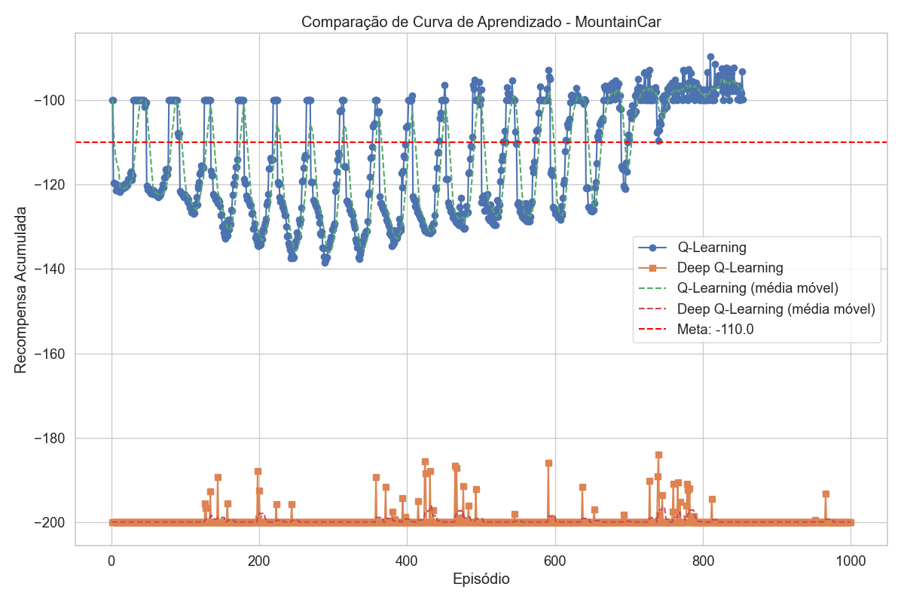
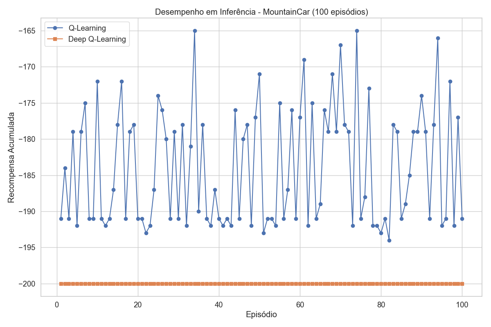

# MountainCar Experimentos: Q-Learning vs Deep Q-Learning

Este projeto compara o desempenho de dois métodos de aprendizagem por reforço aplicados ao ambiente MountainCar-v0:  
- **Q-Learning (tabular)**
- **Deep Q-Learning (DQN)**

Foram realizadas múltiplas execuções para cada abordagem, e os resultados foram agregados para gerar as curvas de aprendizado. Além disso, os agentes foram avaliados em 100 episódios de inferência (sem treinamento) para verificar seu desempenho final.

---

## 1. Q-Learning (Tabular)

### Hiperparâmetros Utilizados:
- **Alpha:** 0.1  
- **Gamma:** 0.99  
- **Epsilon Inicial:** 1.0  
- **Epsilon Mínimo:** 0.01  
- **Epsilon Decay:** 0.995  
- **Episódios:** 10.000  
- **Max Steps:** 200

### Curva de Aprendizado Geral:


---

## 2. Deep Q-Learning (DQN)

### Hiperparâmetros Utilizados:
- **Rede Neural:** 1 camada oculta com 10 neurônios  
- **Learning Rate:** 0.01  
- **Gamma:** 0.9  
- **Epsilon Inicial:** 1.0  
- **Epsilon Mínimo:** 0.01  
- **Epsilon Decay:** 0.995  
- **Batch Size:** 32  
- **Replay Memory Size:** 100000  
- **Update Frequency:** 1000 passos  
- **Episódios:** 1000  
- **Max Steps:** 200

### Curva de Aprendizado Geral:


---
## 3. Comparação dos resultados



---

## 4. Avaliação de Inferência

Nesta fase, os agentes treinados foram avaliados em 100 episódios (sem atualização de pesos) para medir quantas vezes eles alcançaram o objetivo (meta de recompensa acumulada próxima de -110).

### Desempenho dos Agentes Durante Inferência:


*Observação:* O gráfico de inferência compara o desempenho dos agentes Q-Learning e Deep Q-Learning durante a fase de atuação (inferência). A linha horizontal (se presente no gráfico) indica a meta de recompensa acumulada definida para o ambiente.


## Como Executar os Experimentos

### Pré-requisitos
- **Python 3.x**
- Instale os pacotes necessários:
  ```bash
  pip install gymnasium numpy matplotlib pandas seaborn tensorflow torch